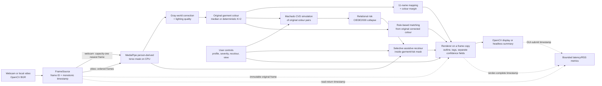

# ChromaLens MVP architecture

This diagram is both the source and the rendered GitHub architecture graphic.
It describes the default T08/T11 MediaPipe CPU path; the deferred SCHP
placeholder is deliberately outside the executable path.

## Safety and evidence boundaries

- The original BGR frame is retained; analytical modules do not mutate it.
- CVD profile and severity are user settings, never a diagnosis.
- Simulation estimates relational risk. It is not the assistive recoloured
  output.
- Mask confidence, colour margin, lighting quality, and risk are distinct
  values; none is presented as a calibrated probability.
- `source_read_to_render_ms` and GUI-only
  `source_read_to_display_submit_ms` are software timing. Sensor-to-photon
  latency is not measured.
- No cloud, account, database, upload, or continuously growing frame queue is
  in the MVP runtime.

The detailed typed contracts are in `src/chromalens/contracts.py`; composition
is in `src/chromalens/pipeline.py`; the frozen evaluation definitions are in
`evaluation/protocol.md`.
