# ChromaLens MVP architecture

This diagram is both the source and the rendered GitHub architecture graphic.
It describes the current SCHP-ATR/OpenVINO CPU demo path. The locked MediaPipe
person-derived torso baseline remains an explicit runtime fallback.

```mermaid
flowchart LR
    A[Webcam or local video<br/>OpenCV BGR] --> B[FrameSource<br/>frame ID + monotonic timestamp]
    B -->|webcam: capacity-one newest frame| C0A[SCHP worker<br/>capacity-one keyframes]
    C0A --> C[SCHP-ATR semantic garments<br/>OpenVINO FP32 on Intel CPU]
    C --> C1[Current-frame mask<br/>optical-flow propagation + stale gate]
    B -->|current webcam frame| C1
    B -->|video: ordered synchronous frames| C
    C0[Explicit fallback<br/>MediaPipe person-derived torso] -. selectable .-> C
    C1 --> D[Gray-world correction<br/>+ lighting quality]
    D --> E[Original garment colour<br/>median or deterministic K=2]
    E --> F[11-name mapping<br/>+ colour margin]
    E --> G[Machado CVD simulation<br/>of original colour pairs]
    G --> H[Relational risk<br/>CIEDE2000 collapse]
    E --> I[Rule-based matching<br/>from original corrected colour]
    H --> J[Selective assistive recolour<br/>inside garment/risk mask]
    C1 --> J
    J --> K[Camera renderer on a frame copy<br/>assistive pixels and outline only]
    F --> K
    I --> K
    K --> P[Presentation compositor<br/>Product or Diagnostic shell outside viewport]
    P --> L[OpenCV display or headless summary]
    B -. immutable original frame .-> K
    M[User controls<br/>profile, severity, recolour, view] --> G
    M --> J
    M --> P
    B -. read-return timestamp .-> N[Bounded latency/RSS metrics]
    P -. render-complete timestamp .-> N
    L -. GUI-submit timestamp .-> N
```

## Safety and evidence boundaries

- The original BGR frame is retained; analytical modules do not mutate it.
- CVD profile and severity are user settings, never a diagnosis.
- Simulation estimates relational risk. It is not the assistive recoloured
  output.
- Mask confidence, colour margin, lighting quality, and risk are distinct
  values; none is presented as a calibrated probability.
- `source_read_to_render_ms` and GUI-only
  `source_read_to_display_submit_ms` are software timing. Sensor-to-photon
  latency is not measured.
- No cloud, account, database, upload, or continuously growing frame queue is
  in the MVP runtime.
- Product and Diagnostic modes consume the same current-frame pipeline result.
  The compositor pastes camera pixels at their exact size and draws all status
  cards and controls outside the camera rectangle; it cannot alter analytical
  masks, colour estimates, risk, or matching results.
- Webcam telemetry distinguishes pipeline FPS from SCHP keyframe FPS and marks
  every mask as inferred, propagated, stale, or unavailable. Finite video keeps
  synchronous per-frame segmentation for reproducible evaluation.

The detailed typed contracts are in `src/chromalens/contracts.py`; composition
is in `src/chromalens/pipeline.py`; the frozen evaluation definitions are in
`evaluation/protocol.md`.
